# SFD : Module L - Le Marché & La Bourse (Marketplace)

**Version :** 1.0
**État :** Validé pour Dév
**Auteur :** L'Architecte

---

### 1. Contexte & Objectif
* **Pourquoi ?** Créer une économie vivante basée sur l'offre et la demande. Introduire la notion de "Rareté" (Scarcity) pour valoriser les actifs numériques et motiver la rétention à long terme.
* **Pour qui ?** Trader, Collectionneur, Joueur compétitif.

---

### 2. User Stories (Agile)

| ID | Description | Critères de succès majeurs |
| :--- | :--- | :--- |
| **US-L1** | **Achat Marché Primaire (Banque)**<br>En tant qu'utilisateur, je veux acheter des joueurs ou des packs directement au système ("La Banque") pour constituer mon équipe initiale. | Gestion de stock fini. Débit immédiat. |
| **US-L2** | **Vente Marché Secondaire (P2P)**<br>En tant que propriétaire d'une carte, je veux la mettre en vente à un prix fixe pour réaliser une plus-value. | Mise en séquestre de la carte. Fixation libre du prix. |
| **US-L3** | **Achat Marché Secondaire**<br>En tant qu'acheteur, je veux acquérir un joueur spécifique vendu par un autre utilisateur car il n'est plus disponible à la Banque. | Transfert de propriété instantané. |
| **US-L4** | **Suivi de la Cote**<br>En tant que trader, je veux voir l'évolution de la valeur d'un joueur (Courbe de prix) pour acheter bas et vendre haut. | Graphique historique des ventes. |

---

### 3. Maquettes / UI (Description Textuelle)

**Hub Marché (Onglets)**
* **Onglet 1 : La Banque (Primaire)**
    * Grille de Packs (ex: "Pack Attaquants Or").
    * Section "Joueurs à la une" (Vendus par le système, stock limité).
    * Badges de rareté (Commun = Gris, Rare = Bleu, Légendaire = Or).
* **Onglet 2 : Transferts (Secondaire)**
    * Liste de listings utilisateurs.
    * Filtres : Poste, Prix Min/Max, Équipe, Rareté.
    * Tri : Prix croissant, Récemment listé.

**Fiche Vente (Modal)**
* **Input :** "Prix de vente" (en Coins).
* **Calculateur automatique :**
    * Prix affiché acheteur : 1000 Coins.
    * Taxe Marché (10%) : -100 Coins.
    * **Net Vendeur :** 900 Coins.
* **Bouton :** "Mettre en vente".

**Historique Joueur (Graphique)**
* Courbe simple (Line Chart) affichant le prix moyen de vente sur les 30 derniers jours.

---

### 4. Flux Fonctionnels

#### A. Mise en Vente (Vendeur)
1.  L'utilisateur sélectionne une carte dans son inventaire ("Mbappé - Rare #4/100").
2.  Il clique sur "Vendre".
3.  Il définit son prix (ex: 5000 Coins).
4.  **Backend :**
    * Vérifie que la carte n'est pas alignée dans une équipe active (Locked).
    * Change le statut de la carte : `ON_SALE`.
    * Crée une entrée dans la table `market_listings`.
5.  La carte disparaît de l'inventaire jouable du vendeur (Mise en séquestre).

#### B. Achat Secondaire (Acheteur)
1.  L'acheteur voit le listing de Mbappé à 5000 Coins.
2.  Il clique sur "Acheter".
3.  **Backend (Transaction Atomique) :**
    * Vérifie `Solde Acheteur >= 5000`.
    * Vérifie que le listing est toujours actif (pas déjà vendu).
    * Débite l'acheteur (-5000).
    * Calcule la taxe (ex: 10% = 500) -> Brûlés (Sink) ou versés au système.
    * Crédite le vendeur (+4500).
    * Transfère la propriété de la carte (Update `owner_id`).
    * Clôture le listing (`SOLD`).
4.  Notification push au vendeur : "Votre Mbappé a été vendu !".

#### C. Réévaluation Hebdomadaire (Système)
1.  Chaque Lundi à 00:00 UTC.
2.  Le système analyse les stats réelles (Opta) des joueurs.
3.  Mise à jour du champ `base_value` (Prix Conseillé) :
    * Note moyenne > 7.0 : +5%.
    * But marqué : +2%.
    * Carton rouge : -3%.

---

### 5. Règles de Gestion (Business Rules)

| ID | Règle | Détail Technique |
| :--- | :--- | :--- |
| **RG-L01** | **Segmentation (Sharding)** | Le marché est cloisonné par "Instance" de jeu (~5000 utilisateurs). Un utilisateur de l'Instance A ne peut pas acheter une carte vendue par un utilisateur de l'Instance B. Cela garantit une économie locale équilibrée et évite l'hyper-inflation mondiale. |
| **RG-L02** | **Taxe Marché (Sink)** | Une taxe de transaction (ex: 10%) est prélevée sur chaque vente du marché secondaire. C'est un mécanisme anti-inflationniste indispensable pour détruire de la masse monétaire créée par les gains de matchs. |
| **RG-L03** | **Rareté & Stock (Scarcity)** | Chaque joueur existe en quantité finie par Instance.<br>- **Common :** Illimité (Achat Banque permanent).<br>- **Rare :** 100 copies max.<br>- **Epic :** 10 copies max.<br>- **Legendary :** 1 copie unique.<br>Chaque carte possède un `serial_number` (ex: #3/100). |
| **RG-L04** | **Valorisation Dynamique** | Le "Prix Conseillé" par le système évolue selon la performance réelle (RG-L03), mais le "Prix de Marché" (Secondaire) est 100% libre. Le système n'impose pas de plafond (Cap), sauf si abus manifeste détecté. |
| **RG-L05** | **Lock Vente** | Une carte mise en vente est inutilisable dans le jeu (Fantasy League) tant qu'elle est listée. Si le vendeur veut jouer avec, il doit annuler la vente. |

---

### 6. Données & Technique

**Table `cards` (Instances de joueurs)**
| Champ | Type | Description |
| :--- | :--- | :--- |
| `id` | UUID | PK. |
| `player_reference_id` | UUID | ID du joueur réel (ex: Mbappé). |
| `owner_id` | UUID | Propriétaire actuel. |
| `scarcity` | ENUM | `COMMON`, `RARE`, `EPIC`, `LEGENDARY`. |
| `serial_number` | INT | Numéro de tirage (ex: 5 pour #5/100). |
| `is_locked` | BOOL | True si en vente ou aligné en équipe. |
| `instance_id` | INT | ID de la division (Segmentation). |

**Table `market_listings`**
| Champ | Type | Description |
| :--- | :--- | :--- |
| `id` | UUID | PK. |
| `card_id` | UUID | FK vers Cards. |
| `seller_id` | UUID | FK User. |
| `price` | INT | Prix de vente brut. |
| `status` | ENUM | `ACTIVE`, `SOLD`, `CANCELLED`. |
| `created_at` | TIMESTAMP | Pour le tri (Récence). |

---

### 7. Critères d'Acceptation (Gherkin)

```gherkin
Scenario: Achat réussi sur le marché secondaire
  Given Je possède 10 000 Coins
  And Une carte "Haaland Rare" est listée à 8 000 Coins
  When Je clique sur "Acheter"
  Then Mon solde passe à 2 000 Coins
  And La carte "Haaland" apparaît dans mon inventaire
  And Le vendeur reçoit 7 200 Coins (8000 - 10% taxe)

Scenario: Tentative d'achat d'un joueur déjà vendu (Race Condition)
  Given Une carte est listée
  When User A et User B cliquent sur "Acheter" simultanément
  Then La transaction de User A réussit
  And La transaction de User B échoue (Erreur "Cet objet n'est plus disponible")
  And Le solde de User B reste inchangé

Scenario: Mise en vente
  Given Je possède une carte "Messi"
  When Je la mets en vente
  Then Je ne peux plus l'aligner dans mon équipe pour le match de ce soir
```
---
### 8. Diagrammes de Séquence (Flux Marché)
#### A. Achat Marché Secondaire (P2P - Transaction Complexe)

```mermaid
sequenceDiagram
    autonumber
    actor Buyer as Acheteur
    actor Seller as Vendeur
    participant API as Backend API
    participant DB as Base de Données
    participant Wallet as Service Wallet

    Note over Buyer, Seller: Scénario : Achat d'une carte "Mbappé" listée par un vendeur

    Buyer->>API: POST /market/buy (ListingID)
    
    rect rgb(30, 30, 30)
        Note right of API: Transaction Atomique
        API->>DB: SELECT * FROM listings WHERE id=ListingID FOR UPDATE
        
        alt Listing Inactif / Vendu
            DB-->>API: Status = SOLD
            API-->>Buyer: Erreur 409 "Objet déjà vendu"
        else Listing Actif
            API->>Wallet: Check Solde Buyer >= Prix (ex: 5000)
            
            alt Fonds Insuffisants
                Wallet-->>API: Solde KO
                API-->>Buyer: Erreur 402 "Fonds insuffisants"
            else Fonds OK
                Wallet->>Wallet: Débit Buyer (5000)
                Wallet->>Wallet: Calcul Taxe (10% = 500) -> Burn
                Wallet->>Wallet: Crédit Seller (4500)
                
                API->>DB: UPDATE cards SET owner_id = BuyerID, locked = FALSE
                API->>DB: UPDATE listings SET status = SOLD
                
                API-->>Buyer: Succès 200 "Achat confirmé"
                API-->>Seller: Notification "Votre carte est vendue !"
            end
        end
    end
```

#### B. Achat Marché Primaire (La Banque - Création)
```mermaid
sequenceDiagram
    autonumber
    actor User as Joueur
    participant API as Backend API
    participant Stock as Gestionnaire Stock
    participant Wallet as Service Wallet

    Note over User, Stock: Scénario : Achat d'un "Pack Or" à la Banque

    User->>API: POST /store/buy-pack (PackID="pack_gold_1")
    
    API->>Stock: Check Stock Instance (Reste-t-il des packs ?)
    
    alt Stock Épuisé
        Stock-->>API: Stock = 0
        API-->>User: Erreur "Rupture de stock"
    else Stock Disponible
        API->>Wallet: Débit User (Prix Pack)
        
        API->>Stock: Décrémenter Stock (-1)
        API->>API: RNG (Génération Aléatoire des cartes)
        API->>API: INSERT INTO user_cards (Cartes générées)
        
        API-->>User: Succès (Affiche l'animation d'ouverture)
    end
